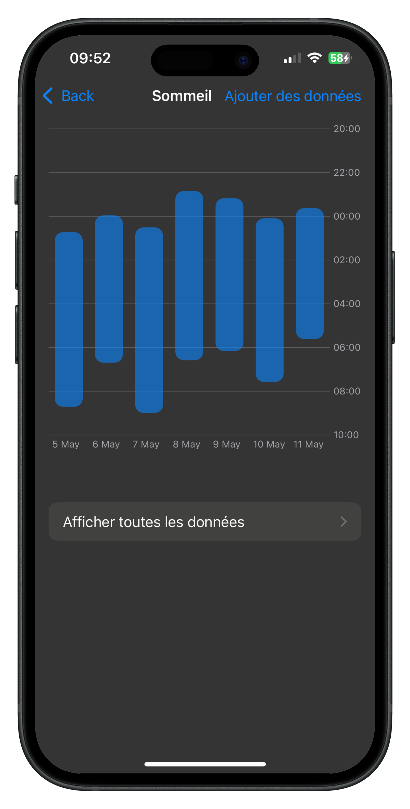
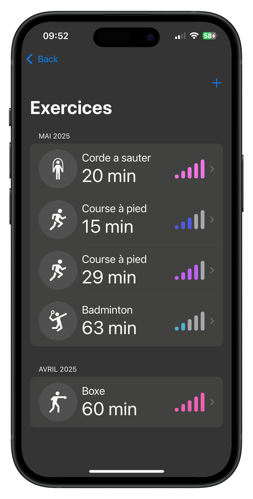
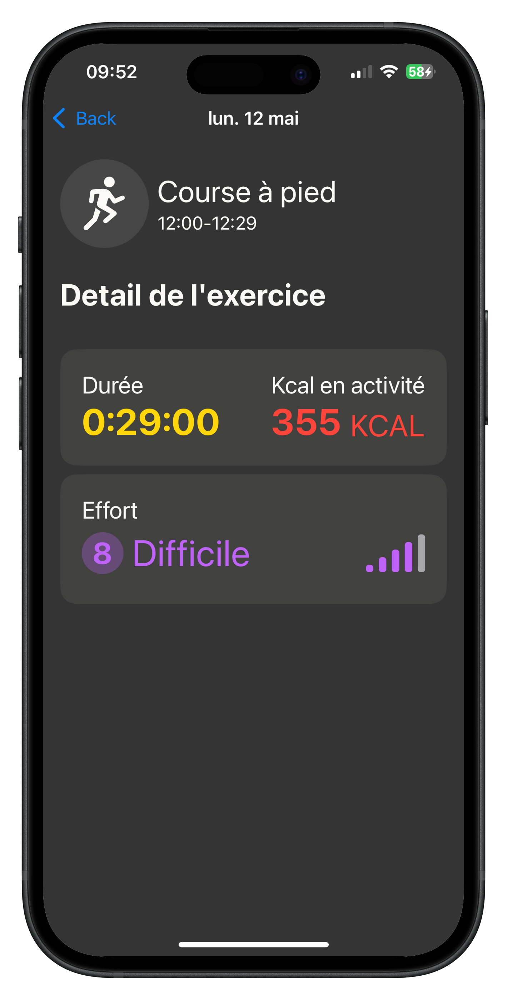
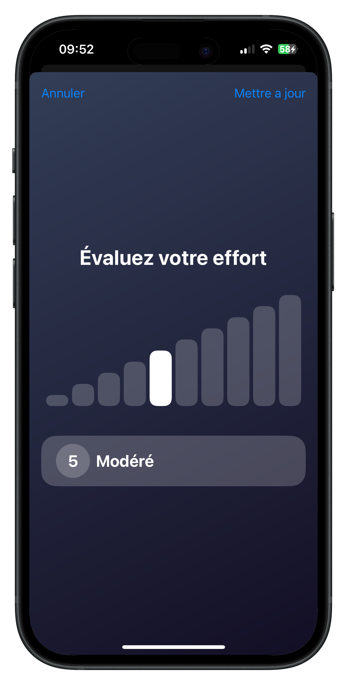
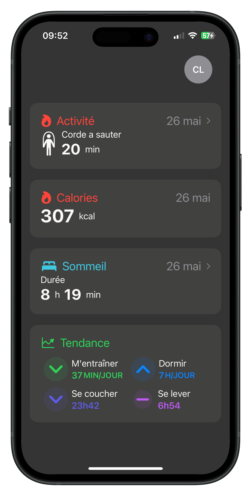
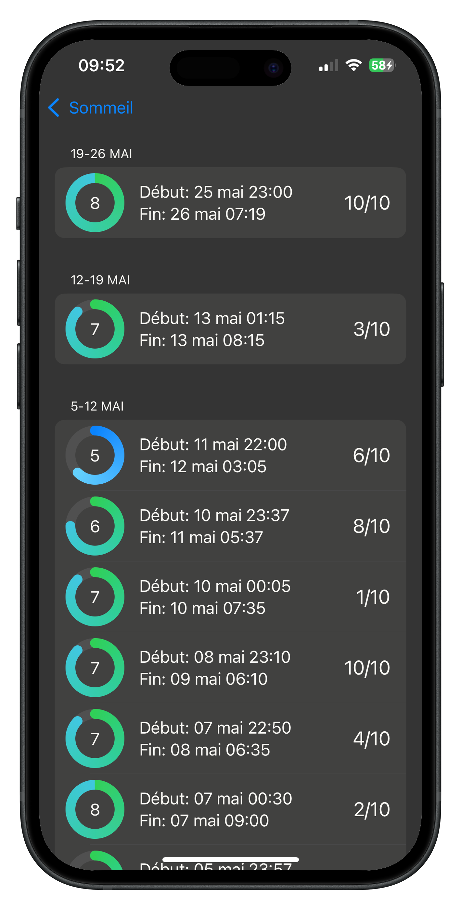
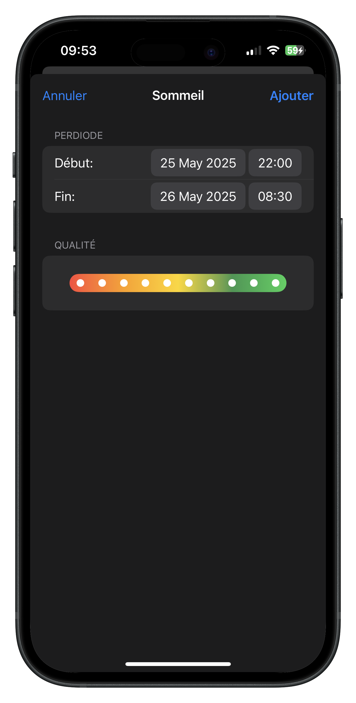
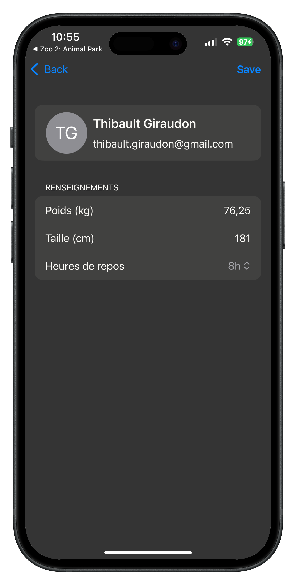

# Arista

## Summary

* [Description](#description)
* [Installation](#installation)
* [Features](#features)

## Description

**Arista** is an iOS app that allows users to track and manage their exercise and sleep sessions.

## Tech Stack
- Swift, SwiftUI
- MVVM architecture
- CoreData for local persistence
- Charts & data visualization
- Animations & haptic feedback

## Architecture

Arista is built using the **MVVM** architecture.

- Views are written in SwiftUI
- Business logic is handled inside ViewModels
- Data persistence is managed through CoreData
- The architecture focuses on testability and maintainability

## Features

### Core Data Integration

To ensure data persistence, Arista uses **Core Data**.

I first created a `PersistenceController` struct to configure the Core Data stack.
This struct includes a shared singleton instance that manages the storage and context.

By using `PersistenceController.shared.container.viewContext`, the app accesses a single shared context throughout the entire project. This makes it easier to load and save data consistently.

### Sleep Graph

This view displays an interactive weekly graph of sleep sessions.
Each bar represents a recorded night, showing both bedtime and wake-up time.

Users can easily spot irregularities, visualize patterns, and track their sleep habits over time.

### Exercise List

This section displays all past exercises, grouped by month.
Each activity is accompanied by an `SFSymbol` and an intensity icon.

Users get a clear overview of their recent physical activity.

### Exercise Detail View

This view provides detailed information about a selected exercise session:
calories burned, date, intensity, and more.

It helps users analyze their effort and progress more deeply.

### Intensity Picker

Inspired by **Apple Fitness**, this custom picker allows users to rate their effort intensity.

They can drag a white cursor that triggers haptic feedback, or tap on the gray bar to move the cursor.
The cursor automatically resizes and animates smoothly using `withAnimation`.

Each intensity level also comes with a background color gradient, making the experience more immersive.

### Trends Overview

On the home screen, users will find:

* Their most recent exercises and sleep sessions
* Calories burned today
* Trend analysis

The app displays four averages:

* Bedtime
* Wake-up time
* Exercise duration
* Sleep duration

These are compared between the last 7 days and the rest of the data.
A `SFSymbol` indicates whether each trend is **stable**, **improving**, or **declining**.

---
  

